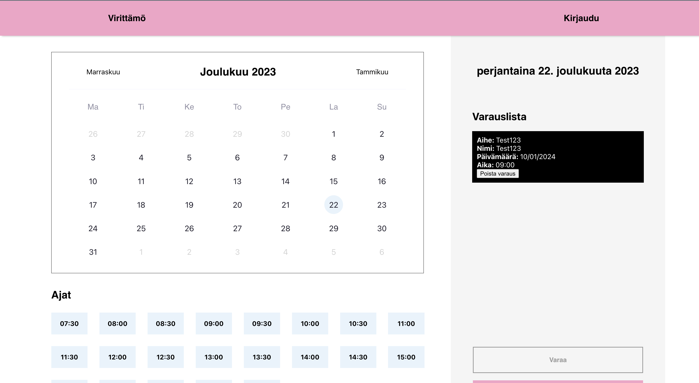

# intranet-Kuutio

Kuutio is a web application for booking Kuutio meeting room in Virittamö. The front-end code is made with React/Vite and the back-end uses Node.js and express framework, Database is MongoDB.

The employees can make the reservation for the Kuutio. The page also shows the booking time data for the current and coming days days.



# Starting the app
The application is intended for use by Virittämö Helsinki only.

```sh
# clone the repository
git clone https://github.com/VirittamoHelsinki/intranet-kuutio.git

# install client node modules
cd client && npm install
# install server node modules
cd server && npm install

# go back to root directory to start dev server
npm run dev
```

open browser: localhost:5024

Note: You would also need the .env files both for client and server to run the application.

### TODO

- [ ] redesign the frontend to use the new design from figma
